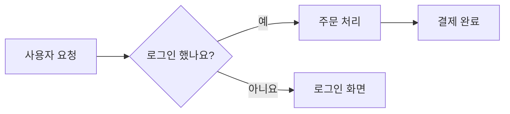
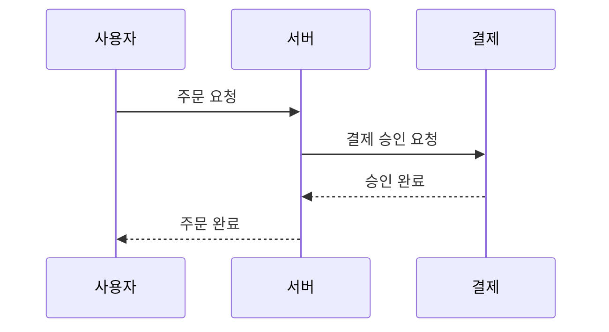
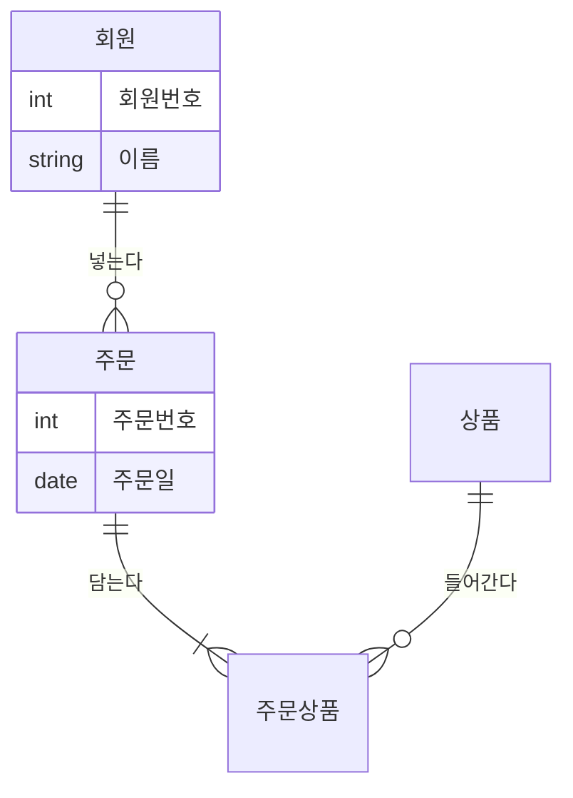
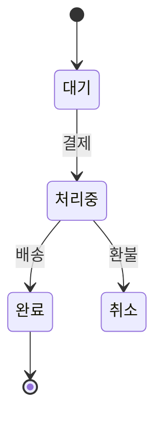
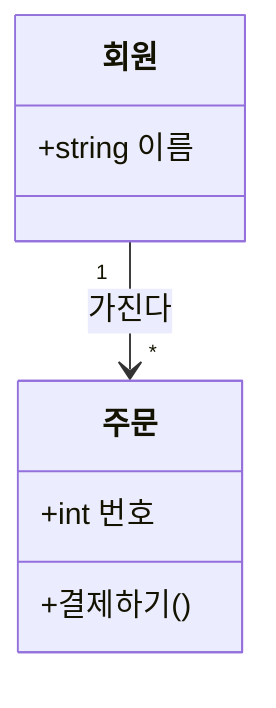

# Mermaid 샘플

yazi에서 이 파일에 커서를 올리면 오른쪽 미리보기에 다이어그램이 **글자 그림**으로 보여요.
`O` 메뉴에서 다이어그램 그림 보기를 고르면, Ghostty 같은 터미널에서 그림으로 하나씩 볼 수 있어요.

## 1. 흐름도 (flowchart)



## 2. 시퀀스 (sequence)



## 3. ER 다이어그램



## 4. 상태 (state)



## 5. 클래스 (class)



## 6. 막대 차트 (xychart)

```mermaid
xychart-beta
  title "월별 주문 수"
  x-axis [1월, 2월, 3월, 4월]
  y-axis "주문" 0 --> 100
  bar [30, 45, 70, 90]
```
